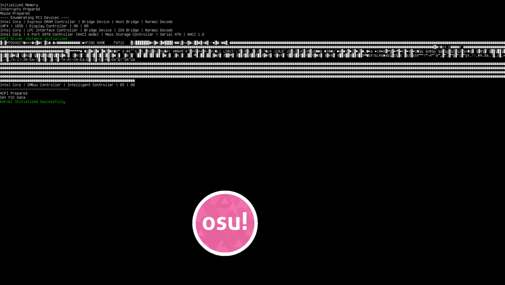

# OSu

__I am not a professional at OS Development by any means.__
__Don't expect this OS to do anything for a long while__

## Table Of Contents

- [OSu](#osu)
  - [Table Of Contents](#table-of-contents)
  - [Disclaimer](#disclaimer)
  - [About](#about)
  - [Contributors](#contributors)
  - [Notable Features](#notable-features)
  - [Running `OSu.img`](#running-osuimg)
    - [Pre-requisites before building and running the OS](#pre-requisites-before-building-and-running-the-os)
    - [Installation of Pre-requisites](#installation-of-pre-requisites)
  - [TODO](#todo)

## Disclaimer

  __There is no correlation between this OS and the development team behind the game OSU! (Please peppy I just need something to do before OSU! Lazer is complete)__

  As a restatment from the beginning I am not a professional at OS Development by any means. Don't expect this OS to do anything for a long while

  This was started as a hobby project to play around with CPU architecture and learning computers at a fundamental level.

  Also I just thought that `OSU` and `OSu` would be kinda funny because of the name to be honest

## About



There is not much to be offered in the OS in its current stages while I learn more OS development and different protocol implementations

- 64-bit OS with simple barebones kernel
- Emulator: QEMU
- Cross compiler: gcc
- Linker: ld
- UEFI bootloader services

To my knowledge this should work outside of QEMU as in real hardware, I have yet to try it out, (I dont have a PS2 keyboard or mouse so I won't get very far) but later version I will experiment further with real hardware

## Contributors

- [ZMan2024](https://github.com/Zman2024) (USB-less behavior)

## Notable Features

- PS2 Keyboard support
- PS2 Mouse support (kind of)
- Simple frame buffer
- UEFI bootloader
- PCI
- Simple heap
- PIT

## Running `OSu.img`

### Pre-requisites before building and running the OS

To run the OS.bin file in the release I would reccomend running the `OSu.img` file through qemu

__[Qemu Download Page](https://www.qemu.org/download/)__

- build-essentials (if your're using a debian based system)
- base-devel (if your're using an arch based system)
- mtools (4.0.27)
- qemu
- g++
- nasm

### Installation of Pre-requisites

- __Debian Installation__

  ``` bash
  sudo apt update 
  sudo apt install build-essentials qemu g++ nasm make
  ```

- __Arch Installation__
  
  ```bash
  sudo pacman -S base-devel nasm g++ make 
  ```

The mtools installation should work fine on ubuntu 20.04 LTS

```bash
mtools --version
```

if the version is not 4.0.27 you can install it like so

```bash
wget -S ftp.gnu.org/gnu/mtools/mtools-4.0.27.tar.gz
tar xf mtools-4.0.27.tar.gz
cd mtools-4.0.27
./configure
sudo make install
```

If for some reason qemu doesn't work (I've noticed this to be an issue with debian based systems), go to the [Qemu Download Page](https://www.qemu.org/download/) and follow the instruction for installtion there

Assuming QEMU is installed properly and you do have the OSu.img. In the same directory where the .img file is saved, run the command (This might not be 100% accurate because I forget to update this with the build, to ensure you are running the correct qemu command you can open the repository under `kernel` and look at the last line of the makefile)

``` bash
qemu-system-x86_64 -machine q35 -drive file=$(BUILDDIR)/$(OSNAME).img -m 256M -cpu qemu64 -drive if=pflash,format=raw,unit=0,file="$(OVMFDIR)/OVMF_CODE-pure-efi.fd",readonly=on -drive if=pflash,format=raw,unit=1,file="$(OVMFDIR)/OVMF_VARS-pure-efi.fd" -net none
```

To build and Run OSu from in qemu from source run

```bash
make
```

to clean the source run

```bash
make clean
```

## TODO

- USB :(
  - [ ] 2.0
  - [ ] 3.0
- networking capabilities
  - Unknown currently
- [ ] Test OS on real hardware
- [ ] Sound Drivers
- [ ] HPET
- [ ] Scheduling :(
  - [ ] Threads
  - [ ] Context Switching
- [ ] File Storage (beatmaps need to be stored somehow)
- [ ] Debugging